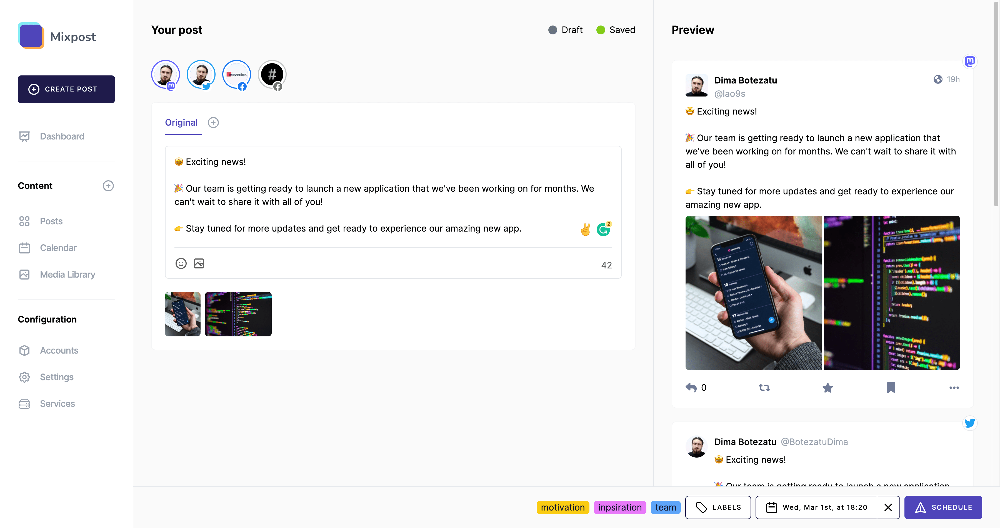

[](https://supportukrainenow.org)

* * *

[](https://mixpost.app)

[](https://packagist.org/packages/inovector/mixpost)
[](https://github.com/inovector/mixpost/actions?query=workflow%3Arun-tests+branch%3Amain)
[](https://packagist.org/packages/inovector/mixpost)

## Introduction

[Mixpost](https://mixpost.app/) it's the coolest Self-hosted social media management software. This package is the lite version of Mixpost PRO, and by integrating it into your Laravel project, you can schedule and organize your social content (Twitter and Facebook support only) all in one place without limits and monthly subscriptions.

It's the perfect social media management solution for bloggers, crafters and entrepreneurs.

**Mixpost is under development and will be released soon. Sign up to be notified when it's released [https://mixpost.app/](https://mixpost.app/)**

Join our community:
- [Discord](https://discord.gg/s2ytAnwm)
- [Facebook Private Group](https://www.facebook.com/groups/inovector)

[](https://mixpost.app)

## Requirements

* Laravel Framework >=9.0
* PHP 8.1 or higher
* Database (eg: MySQL, PostgreSQL, SQLite)
* Web Server (eg: Apache, Nginx, IIS)
* URL Rewrite (eg: mod_rewrite for Apache)

## Installation

You can install the package via composer:

```bash
composer require inovector/mixpost
```

Publish the migrations with:

```bash
php artisan vendor:publish --tag="mixpost-migrations"
```

Mixpost uses [Job Batching](https://laravel.com/docs/9.x/queues#job-batching) and you should create a database migration to build a table to contain meta information about your job batches.

If your application does not yet have this table, it may be generated using the:
```bash
php artisan queue:batches-table
```

Run the migrations with:

```bash
php artisan migrate
```

You can publish the config file with:

```bash
php artisan vendor:publish --tag="mixpost-config"
```

This is the contents of the published config file:

```php
return [
    /*
     * Credentials for third-party services
     */
    'credentials' => [
        'twitter' => [
            'client_id' => env('MIXPOST_TWITTER_CLIENT_ID'),
            'client_secret' => env('MIXPOST_TWITTER_CLIENT_SECRET'),
            'redirect' => env('MIXPOST_TWITTER_REDIRECT', 'http://localhost/mixpost/callback/twitter')
        ],
    ],

    /*
     * Setting options for each social network
     * We recommend leaving these options unchanged
     * You only change them when the API policy of the social networks changes, and you know what you are doing.
     */
    'social_provider_options' => [
        'twitter' => [
            'simultaneous_posting_on_multiple_accounts' => false,
            'post_characters_limit' => 280
        ],
        'facebook' => [
            'simultaneous_posting_on_multiple_accounts' => true,
            'post_characters_limit' => null
        ]
    ],

    /**
     * Mixpost will redirect unauthorized users to the route specified here
     */
    'redirect_unauthorized_users_to_route' => 'login',

    /*
     * The disk on which to store added files.
     * Choose one or more of the disks you've configured in config/filesystems.php.
     */
    'disk' => env('MIXPOST_DISK', 'public'),

    /*
     * The maximum file size of an item in bytes.
     * Adding a larger file will result in an exception.
     */
    'max_file_size' => 1024 * 1024 * 200, // 200MB

    /**
     * Accepted mime types for media library upload.
     * These are all supported mime types for the media files. We do not guarantee that it will work with other types.
     * If you need to remove certain mime types, you are free to do so from here.
     */
    'mime_types' => [
        'image/jpg',
        'image/jpeg',
        'image/gif',
        'image/png',
        'video/mp4',
        'video/quicktime'
    ],

    /*
     * The path where to store temporary files while performing image conversions.
     * If set to null, storage_path('mixpost-media/temp') will be used.
     */
    'temporary_directory_path' => null,

    /*
     * FFMPEG & FFProbe binaries paths, only used if you try to generate video thumbnails
     */
    'ffmpeg_path' => env('FFMPEG_PATH', '/usr/bin/ffmpeg'),
    'ffprobe_path' => env('FFPROBE_PATH', '/usr/bin/ffprobe'),

    /**
     * Define cache prefix
     */
    'cache_prefix' => env('MIXPOST_CACHE_PREFIX', 'mixpost')
];
```

Publish the assets:

```bash
php artisan mixpost:publish-assets
```
Mixpost has the ability to generate images from video while uploading a video file. This would not be possible without FFmpeg installed on your server.
You need to follow FFmpeg installation instructions on their [official website](https://ffmpeg.org/download.html).

After installation, depending on the operating system, you need to set the `ffmpeg_path` and `ffprobe_path` in the Mixpost config file.

Default folder path: `/usr/bin/`. If FFmpeg is there, there is no need to change it.

```php
/*
 * FFMPEG & FFProbe binaries paths, only used if you try to generate video thumbnails
 */
'ffmpeg_path' => env('FFMPEG_PATH', '/usr/bin/ffmpeg'),
'ffprobe_path' => env('FFPROBE_PATH', '/usr/bin/ffprobe'),
```

## Add authorization to Mixpost UI

Mixpost does not come with any user management, we assume that you already provide this in your own app. You can use a gate check to determine who can access Mixpost.

You can determine which users of your application are allowed to view the Mixpost UI by defining a gate check called viewMixpost in your `app/Providers/AppServiceProvider.php` file.

```php
public function boot()
{
    \Illuminate\Support\Facades\Gate::define('viewMixpost', function ($user = null) {
        return optional($user)->email === 'dima@inovector.com';
    });
}
```

Mixpost will redirect unauthorized users to the route specified in the `redirect_unauthorized_users_to_route` key of the Mixpost config file.

## Visit the UI

After performing all these steps, you should be able to visit the Mixpost UI at /mixpost.

## Testing

```bash
composer test
```

## Changelog

Please see [Releases](../../releases) for more information what has changed recently.

## Contributing

By participating in this project you agree to these conditions 👇

Please note that this project is a [commercial product](https://mixpost.app/), and this repository is the lite version of Mixpost PRO. We work hard to offer the community the best free social media manager solution and please read this section carefully.

If you want to add a feature, it's better to open an issue before you start coding. It is important for us that features from the LITE version do not correlate with features from the Mixpost PRO. PRs with optimizations, bug fixes are welcome.

Please, be very clear on your commit messages and pull requests, empty pull request messages may be rejected without reason.

When contributing code to Mixpost, you must follow the [PSR-12 Coding Standard](https://github.com/php-fig/fig-standards/blob/master/accepted/PSR-12-extended-coding-style-guide.md). The golden rule is: Imitate the existing Mixpost code.

## Security Vulnerabilities

Please review [our security policy](../../security/policy) on how to report security vulnerabilities.

## Credits

- [Dima Botezatu](https://github.com/lao9s)
- [All Contributors](../../contributors)

## License

Mixpost is licensed under the [MIT License](LICENSE.md), sponsored and supported by [Inovector](https://inovector.com).
